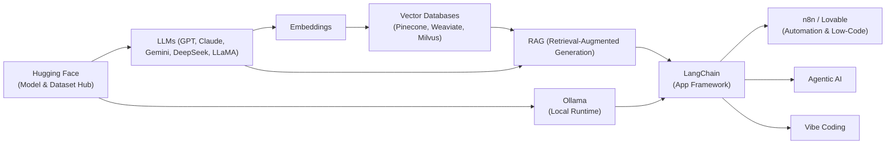

If you’re a developer (like me, coming from PHP and web apps), stepping into the world of AI can feel like drinking from a firehose.  
There are **too many new words** — some are company names, some are research concepts, some are tools you can actually install.  

This post is my attempt to make sense of the most common terms I kept bumping into. Hopefully it helps you too.



---

## 🧠 Core AI & LLM Concepts

### **LLM (Large Language Model)**
A type of AI trained on huge amounts of text to understand and generate language. Examples: GPT, Claude, Gemini, DeepSeek.

### **Transformers**
The deep learning architecture that powers modern LLMs. Instead of reading text word by word, it looks at relationships between tokens all at once. This makes models like GPT possible.

### **Tokenization**
Before an LLM can read text, it breaks it down into tokens (pieces of words). Example: `"PHP rocks!"` might become `[PHP] [rocks] [!]`.  
Important because tokens affect cost, speed, and memory.

### **Context Window**
How much text (in tokens) an LLM can "remember" at once.  
Example: GPT-4 might handle 128k tokens (~100,000 words). If you exceed that, older parts get forgotten.

### **Embeddings**
A way to represent text as numbers (vectors) that capture meaning. Example: "dog" and "puppy" end up close to each other in vector space.

### **Vector Database**
A database optimized for storing and searching embeddings. Used to quickly find semantically similar text. Examples: Pinecone, Weaviate, Milvus.

### **RAG (Retrieval-Augmented Generation)**
A technique where you feed extra knowledge into an LLM by retrieving relevant docs from a vector database, instead of making the model memorize everything.

### **Fine Tuning**
Adjusting a pre-trained LLM with your own dataset. Good for domain-specific knowledge (like law or medical) or tone.

### **Multi-Modality**
When an AI can process not just text, but also images, audio, or video. Example: GPT-4 with Vision, or Gemini handling text + images + code.

### **Why LLM Needs GPU**
GPUs are specialized at parallel computation (matrix multiplications). LLMs are huge, so CPUs would be way too slow.

### **Entropy — Balancing Randomness and Determinism**
When generating text, entropy (via temperature/top-p sampling) controls randomness.  
- Low randomness → more predictable but boring answers.  
- High randomness → more creative but sometimes nonsense.  

---

## ⚡ AI Tools & Companies

### **GPT**
OpenAI’s flagship LLM family. ChatGPT is the app version, GPT is the model itself.

### **Claude**
Anthropic’s family of LLMs. Known for being careful, safe, and conversational.

### **Gemini**
Google DeepMind’s family of multimodal AI models. Strong integration with Google products.

### **DeepSeek**
An emerging open-source LLM from China, optimized for speed and efficiency.

### **Ollama**
A tool for running open-source LLMs locally on your laptop with one command. Example:  
```bash
ollama run llama3
```

### **LLaMA**
Meta’s open-source LLM (different versions like LLaMA 2, LLaMA 3). Forms the base for many community projects.

### **Anthropic**
The company behind Claude, founded by ex-OpenAI employees. Focused on "constitutional AI" (aligning models with human values).

### **n8n**
An open-source workflow automation tool (like Zapier) that can integrate LLMs, APIs, and databases into pipelines.

### **Lovable**
A YC-backed startup that lets you generate full-stack apps with natural language prompts. Think of it as "AI + coding copilot" on steroids.

### **LangChain**
A developer framework (Python/JS) for building AI apps. It helps you connect LLMs with tools, manage RAG pipelines, and build AI agents that can take actions.  
Think of it as a **framework layer** that makes LLMs practical in real-world applications.

### **Hugging Face**
An open-source AI hub and community. It provides:  
- **Model Hub** (download/share models like LLaMA, Mistral, Stable Diffusion)  
- **Transformers library** (Python package for using models)  
- **Datasets Hub** (shared datasets for training/fine-tuning)  
- **Spaces** (hosted demos and apps)  

Think of it as the **GitHub of AI models and tools**.

---

## 🌟 New AI Trends

### **Agentic AI**
Instead of just answering, an AI acts like an *agent* — can plan, call APIs, run tools, and take actions autonomously.

### **Vibe Coding**
Letting the AI generate code in an exploratory, playful way — where you don’t always know the end result, but you’re "vibing" with the model as a creative partner.

---

## 🚀 Final Thoughts
AI terms can feel overwhelming at first, but here’s the good news:  
You **don’t need to learn everything at once**. Start with **LLMs + embeddings + RAG**, because they’re the building blocks of most real-world AI apps today.

Then, experiment with **Ollama** locally, or try integrating **n8n** workflows.  
Before you know it, you’ll be shipping AI features like you ship PHP apps.

---

*Did I miss a term that confused you? Drop me a comment and I’ll add it to the list.*
